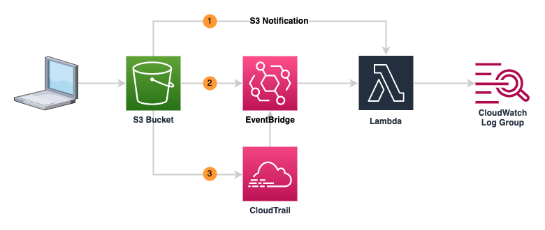

# terraform-aws-s3-eventbridge-translation
This repository contains code for use with https://headforthe.cloud/article/lost-in-translation/ and deploys the following infrastructure:




## Pre-requisites
This repository assumes you'll be using AWS S3 as a backend, and that you have the following
* Terraform installed locally
* an S3 bucket already configured to hold the terraform state, 
* a dynamoDB table to handle locking. The primary key on the table should be `LockID`
* IAM permissions to write to the above.

## Deploying Terraform
### Initialising Terraform
Before deploying, we need to initialise the Terraform code. We can simply run `terraform init` and provide the values as prompted, or we can use the command below, replacing the values as appropriate.

```
terraform init \
    -backend-config="region=_insert deployment region_" \
    -backend-config="bucket=_insert state bucket name_"  \
    -backend-config="key=_insert name of state file_"  \
    -backend-config="dynamodb_table=_insert name of dynamoDB lock table_"
```

### Deploying the infrastructure via Terraform
To deploy the components, run `terraform apply`

### Destroying the infrastructure via Terraform
To remove the components, run `terraform destroy`
